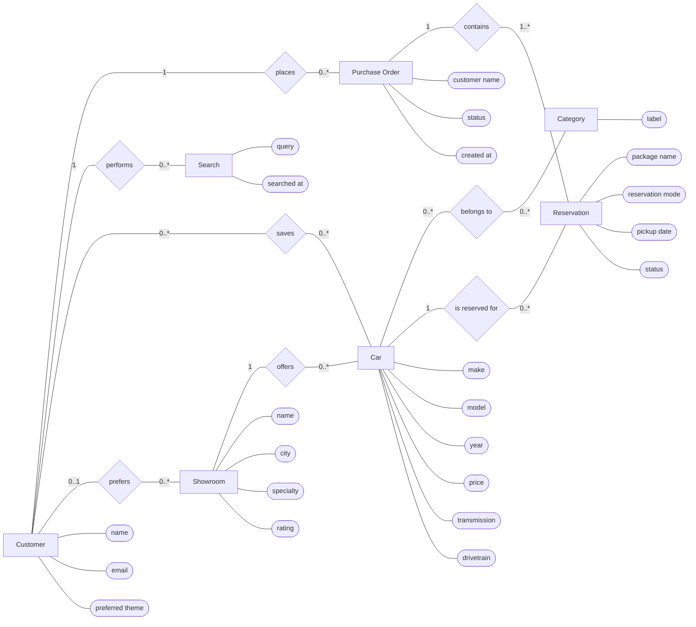

# CarStore Chen ER Diagram

Paste only the code inside the Mermaid block into Mermaid Live.

## Chen Notation Guide

- Rectangles represent entities, such as `Customer`, `Car`, and `Showroom`.
- Diamonds represent relationships, such as `saves`, `places`, and `offers`.
- Ovals represent attributes, such as `name`, `price`, and `status`.
- Cardinalities are written on the relationship lines:
  - `1` means exactly one.
  - `0..1` means optional one.
  - `0..*` means zero or many.
  - `1..*` means one or many.
